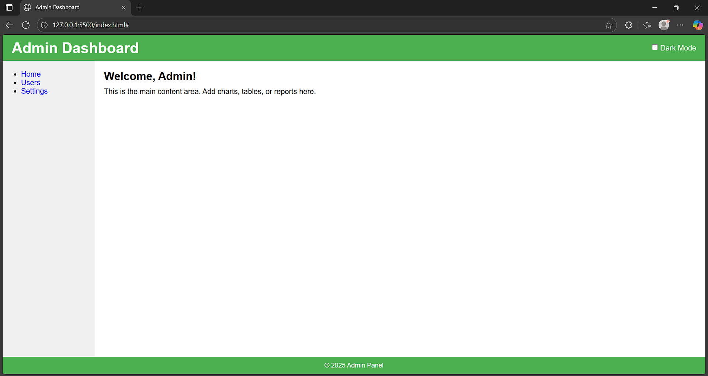

# 🛠️ Admin Dashboard (Responsive with Theme Switching)

This is a professional, responsive **Admin Dashboard** interface built using **HTML**, **CSS Grid**, and a **light/dark mode switcher**.

The layout is designed to be clean, minimal, and fully adaptable to different screen sizes. Theming is handled using CSS variables and toggled using JavaScript.

---

## 📸 Preview




---

## 🚀 Features

- ✅ **CSS Grid layout** for modern, responsive design
- 🌗 **Light and Dark Theme Toggle**
- 🖥️ Fully responsive for desktop and mobile
- 🎨 Clean and accessible UI
- ⚡ Fast loading (no external libraries used)

---

## 📁 Project Structure

admin-dashboard/
├── index.html        # Main HTML structure
├── style.css         # Styling and theming using CSS Grid and variables
└── README.md         # Project documentation
```

---

## 🌙 Theme Switching

- The theme switcher toggles between **light** and **dark** modes.
- Built using a simple checkbox and class toggling in JavaScript.
- Color schemes are controlled using **CSS variables** for better maintainability.

---

## 📱 Responsive Design

This dashboard adjusts automatically to:
- Desktop 💻
- Tablet 📱
- Mobile 📲

Try resizing your browser to see it in action!

---

## 📌 License

This project is licensed under the [MIT License](LICENSE) – feel free to use and customize it.

---

## 🙌 Author

Made by [Asheem Khan(23BCS13395)](https://github.com/AsheemK7)
